# Day 01

## What is Machine Learning

**Machine learning is a field of computer science that uses statistical techniques to give computer systems the ability to "learn" with data, without being explicitly programmed.**

* Simply words: Learning from data
* Machine Learning → Data + Algorithm-Model → Generate a pattern
* Explicitly programming: For a given Scenario we want to write a code
* If we give a new data to the model → Gives an output according to it

## Traditional Programming vs Machine Learning

### Traditional Programming

* You give the data. You give the program(You build the Logic)
* Then the output will be generated

### Machine Learning

* You give the data (you provide both input and the output)
* But you do not build a program(logic)
* Logic is automatically generated
* You do not write the code for each and every case. It is automatically generated

### Traditional vs ML using Simple Scenario

* Adding two numbers: In traditional programming, we have to give the two inputs and it will give the output, but this will never give the addition for three or four numbers.
* ML we have to give the data set, and it will recognize the pattern of sum and predict the output. Later if we give three, or four numbers also by recognizing the pattern it will give the output.

### Machine Learning Scenarios

* Email classifiers
* Image classification
* Data Mining
  If the data is hidden very deeply, it is difficult to do the data analysis using just plots. Then need to use a Machine learning algorithm and get some predictions from it. After that can identify the patterns of the hidden data. This whole process is called as Data mining.

## Machine Learning Paradigm shift

* Affordable hardware resources
* Internet speed
* Evolution of the algorithms
* Storage facilities and cloud computing

## CPU Vs GPU Vs TPU

### CPU
* Versatile processor
* Can do many tasks an average speed
* Generalized Processor and not a specialized processor

### GPU
* Render the graphics faster than CPU
* Specialized in handling matric operations
* Better performance for AI/ML applications than the CPU

### NPU – Neural processing unit
Use to process the deep neural networks faster  
Eg:
1. Alibaba → Ali NPU
2. Intel → IQ
3. Google → TPU-Tensor processing unit (Google developed their own deep neural api called tensorflow and to process it they have implemented the processing unit called TPU)
4. FPGA → also used to process AI applications

## AI vs ML vs DL

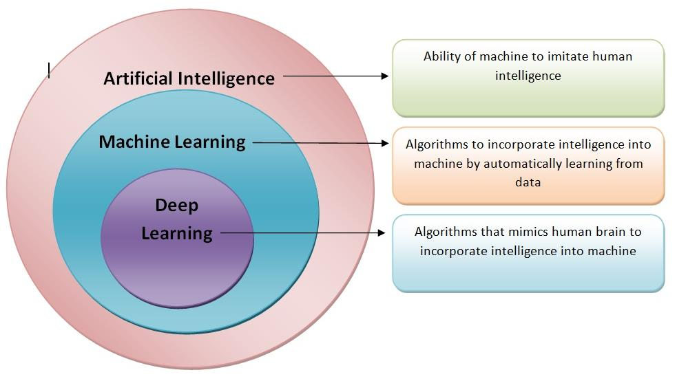  

## Human Intelligence vs Artificial Intelligence

### Human Intelligence has various forms

1. Pattern recognition
2. Intelligent quotient
3. Emotional quotient
4. Creativity & Imagination

### Artificial Intelligence Scope

Considered only the pattern recognition at this stage, not considered the Imagination or creativity.  

## AI evolution

* 1901 - Principal component Analysis(PCA) - It is a statistical method which allows to reduce the dimensionality of the data.
* 1958 - Concept of perceptron
* 1965 - Fuzzy sets
* 1969 - Limitations of perceptron (Smallest ANN that can learn a linear problem)
* 1982 - Self-organizing map(SOM) - Taking set of perceptions and give data and ask to figure out a pattern-Concept for the un supervised Learning
* 1986 - Backpropagation 
* 1993 - Decision tree algorithms
* 1995 - SVM
* 1995 - 2001 - Random forest
* 1995 - Convolutional neural Network
* 2006 - Fast learning for deep nets
* 2007 - Greedy layer-wise training for deep nets
* 2012 - Alexnet

## AI Stages

* Symbolic AI - Rules are generated using human intervention using giant if-else statements
* Expert systems - Expert knowledge is converted into a code - Eg: Chess game
* Fuzzy logic - Eg: Lung cancer detection

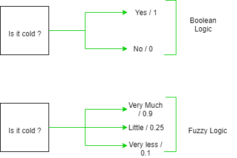  

## Machine Learning vs Fuzzy logic

* Machine learning is a technique of artificial intelligence to give better intelligent decisions.
* Fuzzy logic is a process of giving conclusions or decisions from an uncertain problem.

## Main tasks of AI

* Classification
* Estimation / Prediction
* Search
* Optimization
* Inference(getting new Knowledge)
* All of these are approximations

## AI vs ML vs DL in Diagram

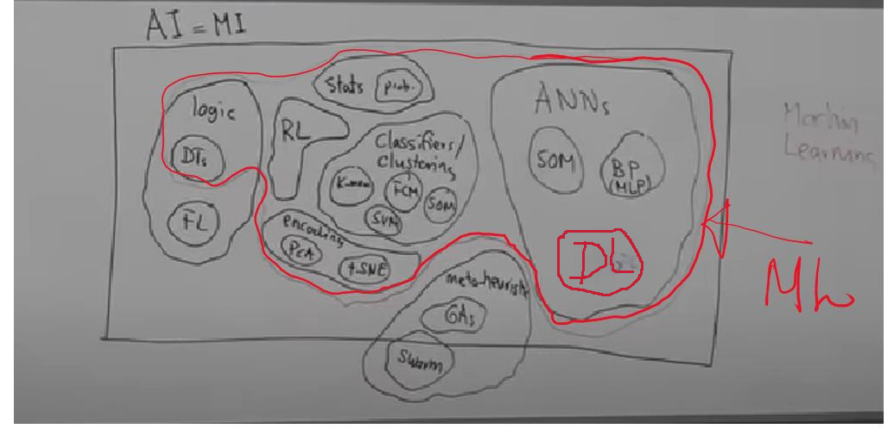  

## Deep Learning

* In ML we have to provide the features.  
  Ex: In a dog , cat classification problem if we use ML , then we want to give the features.
* In deep learning, features will be detected by the system.
* When there is a large amount of data seep learning gives good results.
* Deep learning is very well suited for unstructured data.
* In the ML model, Accuracy will be stabilized after a some extent. But deep learning is data-dependent

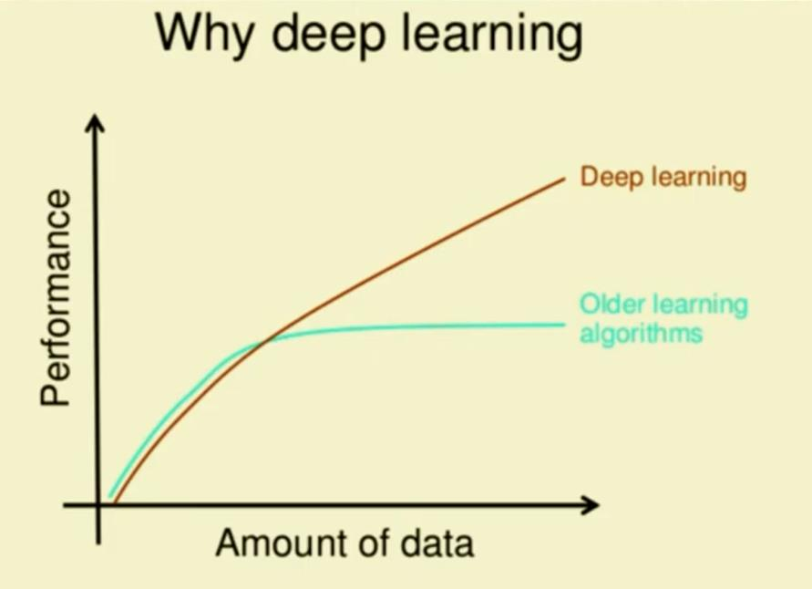  

## Types of Machine Learning
(Based on the amount of the supervision needed)

1. Supervised Learning
2. Unsupervised Learning
3. Semi-supervised Learning
4. Reinforcement Learning

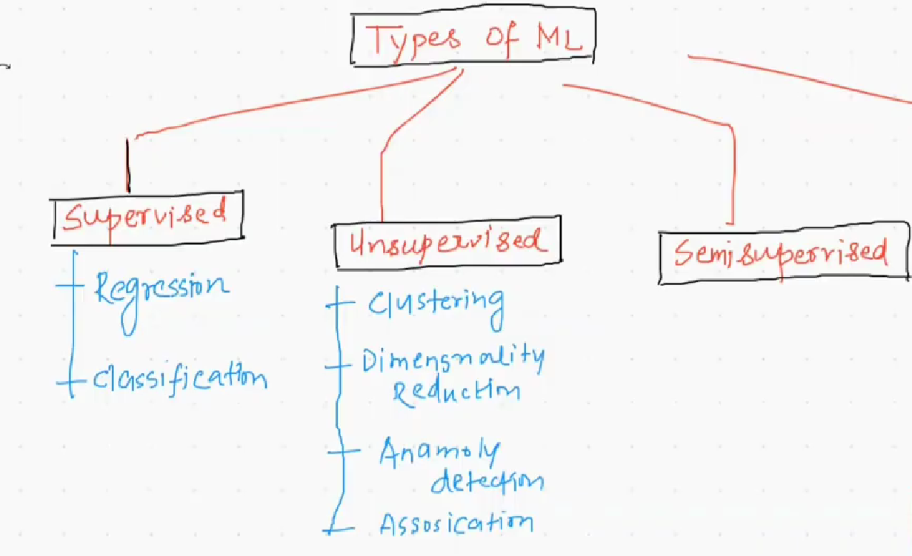  
 
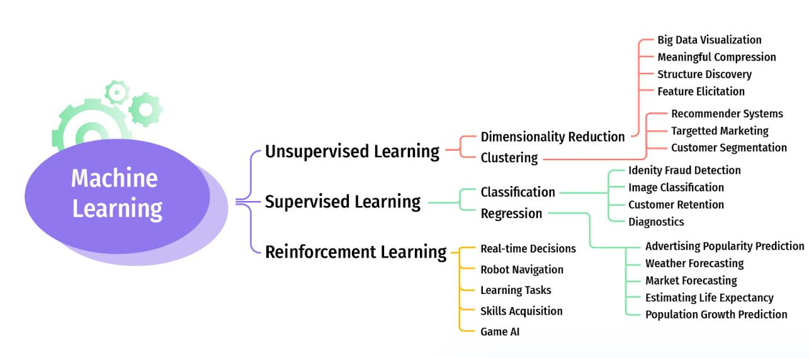  

### Supervised learning

If the values of the output are known for a given input, then that type of learning is called supervised learning. (Labeled data)  

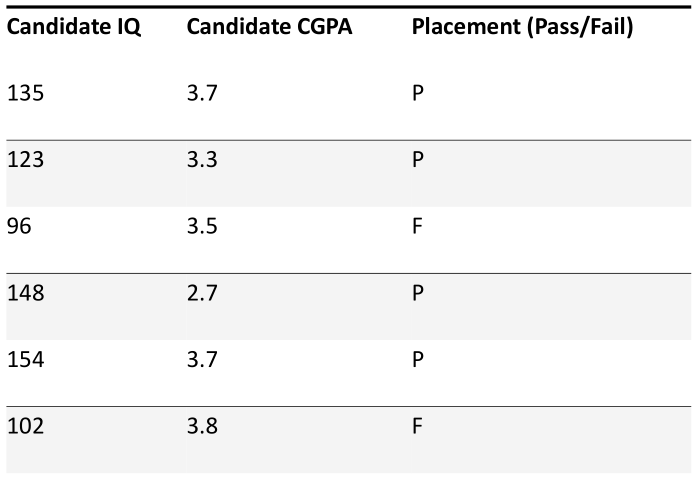  

### Types of Supervised Learning

1. Regression  
 * Continuous Numerical Data  
 * Getting one output from one or multiple attributes.  
 * Eg: Stock price detection, House price detection, Maximum revenue generation

2. Classification  
 * Categorical data, Numerical discrete  
 * Getting two or more outputs.  
 * Eg: Email Spam classification, Credit card fraud detection

### Un-supervised Learning

No labeled output data. The only input is available.  

1. Clustering
 * Making it to groups without labeled.
 * Eg: E-commerce customer clustering

2. Dimensionality Reduction
 * Reduce the columns by converting related columns in to a single column.
 * PCA

3. Anomaly detection
 * Availability of outliers.
 * Fraud detection Manufacturing defect detection

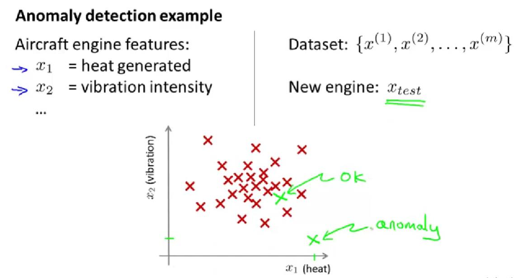  
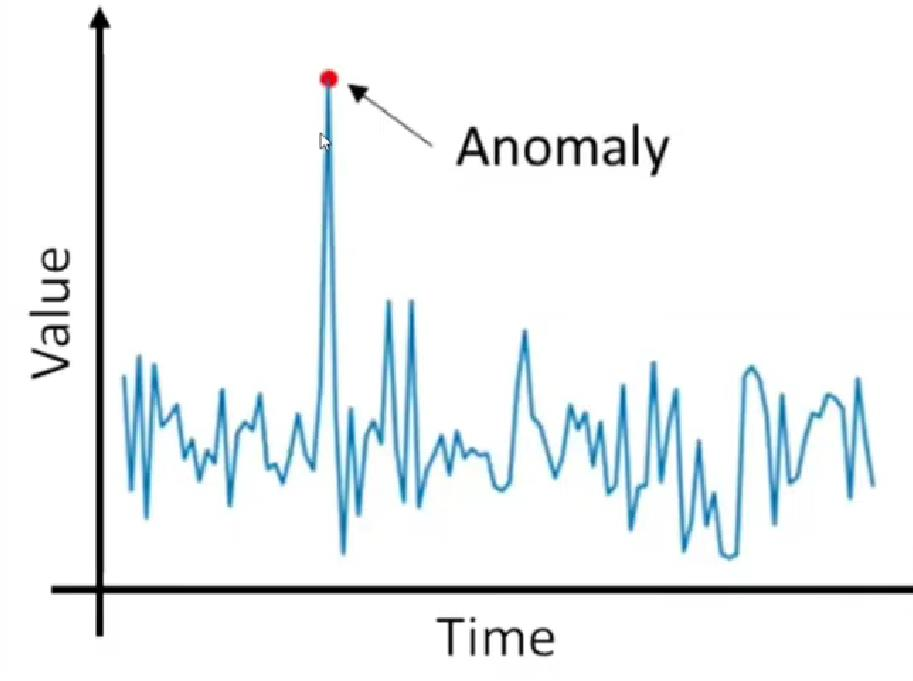  

4. Association Rule Learning
 * Supermarket goods arrangement (Market Basket Analysis)
 * Eg: Baby diapers - Beer

### Semi-Supervised Learning

#### Goals  

* Labeled +Un Labeled Data (20+80%)
* Predictive or Classification based
* Do not use for normal cases
* Inductive approach and Transudative approach
* (S3vm/Tsvm)
* Graph based techniques
* Mixture models-SSGMM  

#### Problems  

* Heavily rely on Assumptions Less accuracy  
* Author specified algorithms.  
* Have to hire some annotators like amazon mechanical Turk to label the data  

#### Use cases  

* Covid 19 case prediction  
* Google photo labelling  

### Reinforcement Learning

* No input or output data available.
* Only algorithm is available. Start from scratch
* Eg: Driver less Vehicles.

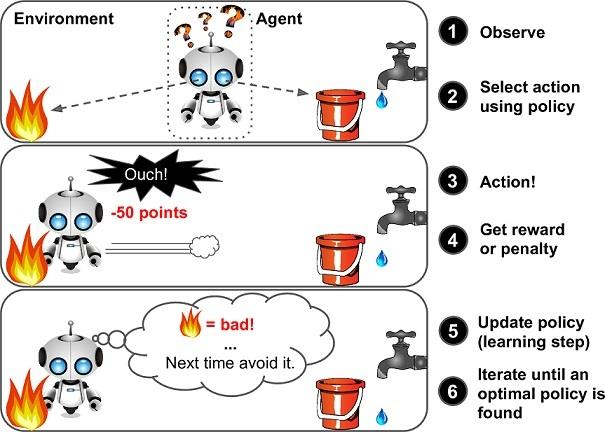  

## ML Models Classification based on Production

1. Batch Learning: Training the models in a batch manner(regular intervals)
2. Online Learning: Training happens in an Incremental manner

**Production Means?**  

It is the server that our project is going to run.After creating the ML software we have to deploy it is a server  

### Batch Learning

* The systems Learn only once
* Uses all available data
* Takes more time to train
* Offline process
* Trained before being deployed
* After being deployed, no learning process

Eg: House Price Prediction  

**Drawbacks**  

* Expensive for Large data
* Time Consuming
* Problem of availability

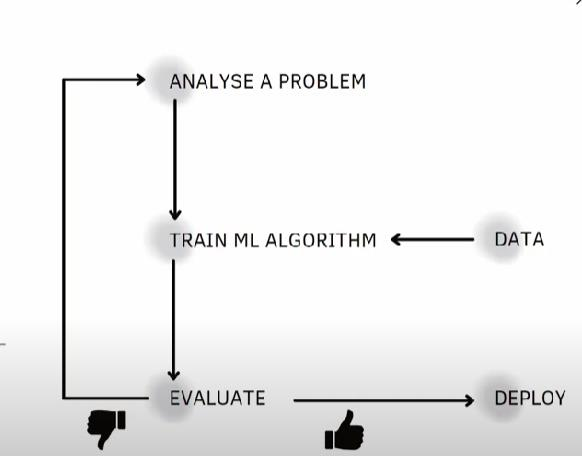  

### Online Learning

* The system learns on the fly
* The system learns incrementally
* It is fed with individual data with mini batches.
* Each learning step is very fast
* Process is online
* Keeps learning on the fly, after being deployed as new data arrives
* Online Learning needs special libraries. Eg: River

Eg: Youtube recommendation system  

**Drawbacks**  

* Continuous monitoring is needed.
* Additional Libraries required.
* Risk

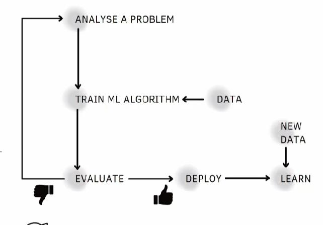  

#### Learning Rate

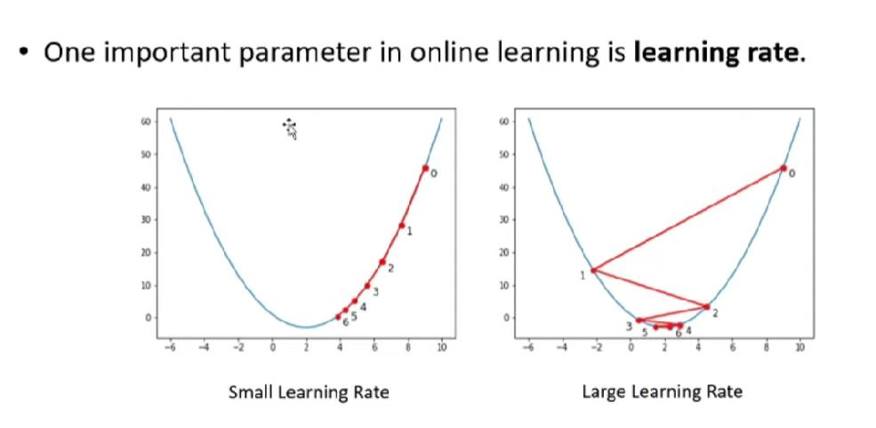  

### Batch Learning vs Online Learning

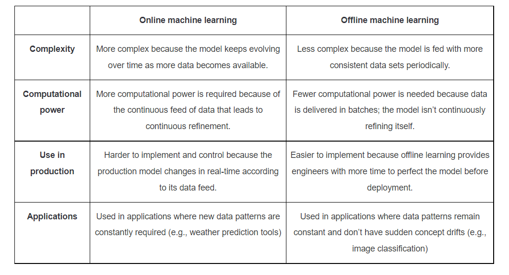  
