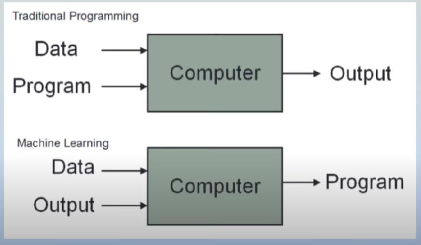

# Day 01

## What is Machine Learning

**Machine learning is a field of computer science that uses statistical techniques to give computer systems the ability to "learn" with data, without being explicitly programmed.**

* Simply words: Learning from data
* Machine Learning → Data + Algorithm-Model → Generate a pattern
* Explicitly programming: For a given Scenario we want to write a code
* If we give a new data to the model → Gives an output according to it

## Traditional Programming vs Machine Learning

### Traditional Programming

* You give the data. You give the program(You build the Logic)
* Then the output will be generated

### Machine Learning

* YOU GIVE THE DATA (YOU PROVIDE BOTH INPUT AND THE OUTPUT)
* BUT YOU DO NOT BUILD A PROGRAM(LOGIC)
* LOGIC IS AUTOMATICALLY GENERATED
* YOU DO NOT WRITE THE CODE FOR EACH AND EVERY CASE. IT IS AUTOMATICALLY GENERATED

### Traditional vs ML using Simple Scenario

* Adding two numbers: In traditional programming, we have to give the two inputs and it will give the output, but this will never give the addition for three or four numbers.
* ML we have to give the data set and it will recognize the pattern of sum and predict the output. Later if we give three, or four numbers also by recognizing the pattern it will give the output.

