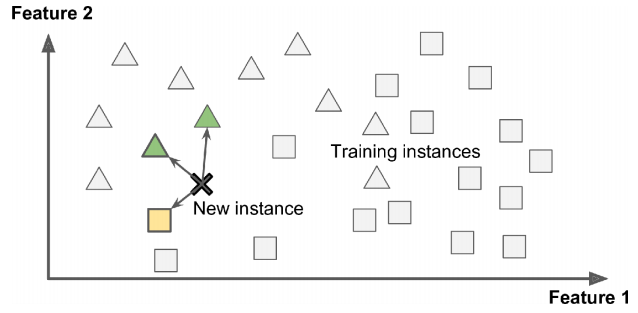
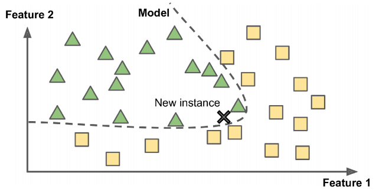
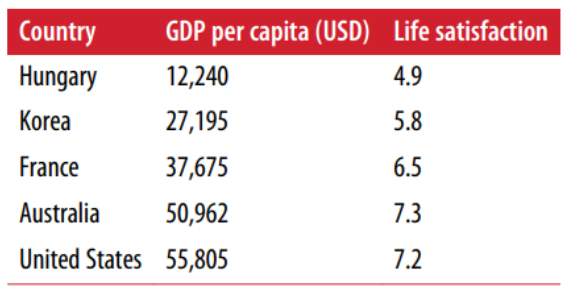
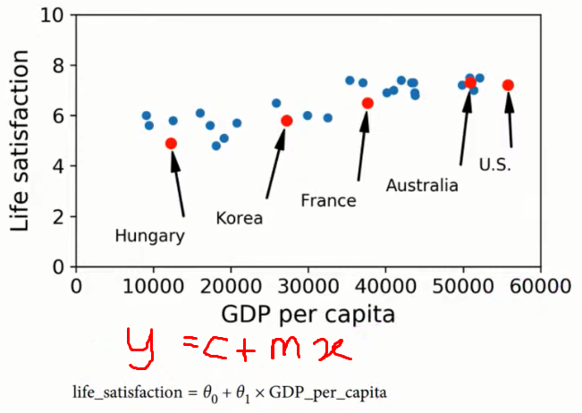
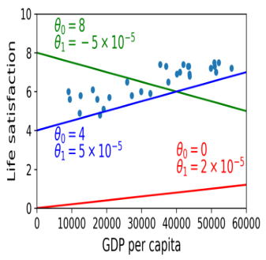
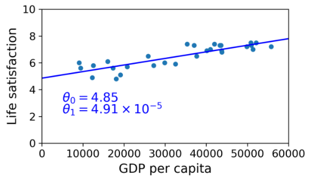
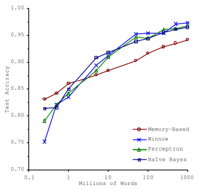

# Day 2

## INSTANCE BASED LEARNING vs MODEL BASED LEARNING

### Instance Based Learning

System learns examples by heart and generalizes the new cases by comparing it with the similarities.

  

### Model Based Learning

Building a model to predict the generalization.

  

### EX: DOES MONEY MAKES PEOPLE HAPPIER?

**GDP per capita vs Life satisfaction data set**  

  

**Can you see a Model?**

  

**Determine the best model using the parameters** 

  

* Specify a performance measure(Utility function or cost function)
* Utility(fitness) function determines how good your model is
* Cost function determines how bad the model is
* For linear regression problems normally use the cost function which measures the distance between linear model predictions and the training examples.  

**Best fit Model**

  

## CHALLENGES IN ML

1. Data Collection
2. Insufficient data
3. Non-representative data
4. Poor quality data
5. Irrelevant Features
6. Overfitting and Underfitting
7. Software Integration
8. Deployment
9. Cost

### DATA COLLECTION

If you do not have ready-made data then gathering data is a difficult task:  

Two methods can be used:  
1. API
2. Web Scraping

### INSUFFICIENT DATA

* How a Toller learns “What is an Apple?”
* For small Machine Learning problem also needs thousands of examples
* Image recognition, and speech recognition may need millions of examples
* If data is insufficient can be reused the parts of the existing model

Eg: MICROSOFT Research of Algorithms vs Data  

  

