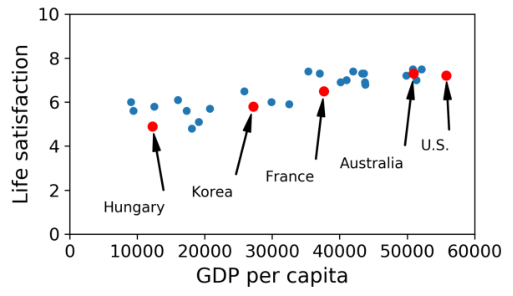
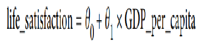

# Day 2

## Recap: Day 1

### SUPERVISED LEARNING ALGORITHMS

* k-Nearest Neighbors
* Linear Regression
* Logistic Regression
* Support Vector Machines (SVMs)
* Decision Trees and Random Forests
* Neural networks^2

### UN-SUPERVISED LEARNING ALGORITHMS

1. Clustering
   - K-Means
   - DBSCAN
   - Hierarchical Cluster Analysis (HCA)

2. Anomaly detection and novelty detection
   - One-class SVM
   - Isolation Forest

3. Visualization and dimensionality reduction
   - Principal Component Analysis (PCA)
   - Kernel PCA
   - Locally-Linear Embedding (LLE)
   - t-distributed Stochastic Neighbor Embedding (t-SNE)

4. Association rule learning
   - Apriori
   - Eclat

## INSTANCE BASED LEARNING vs MODEL BASED LEARNING

### Instance Based Learning

System learns examples by heart and generalizes the new cases by comparing it with the similarities.

  

### Model Based Learning

Building a model to predict the generalization.

  

### EX: DOES MONEY MAKES PEOPLE HAPPIER?

**GDP per capita vs Life satisfaction data set**  

  

**Can you see a Model?**

  
 
  

**Determine the best model using the parameters** 

  

* Specify a performance measure(Utility function or cost function)
* Utility(fitness) function determines how good your model is
* Cost function determines how bad the model is
* For linear regression problems normally use the cost function which measures the distance between linear model predictions and the training examples.  

**Best fit Model**

  

