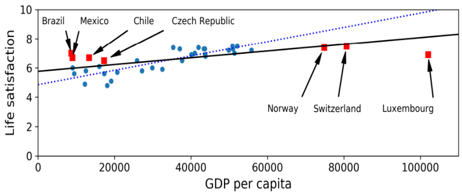
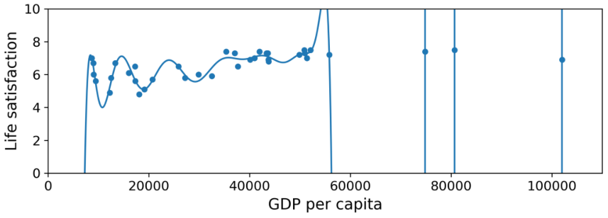
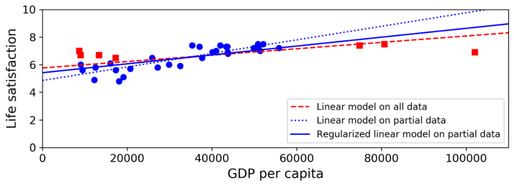
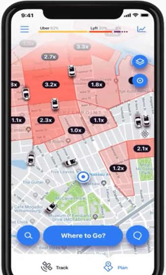
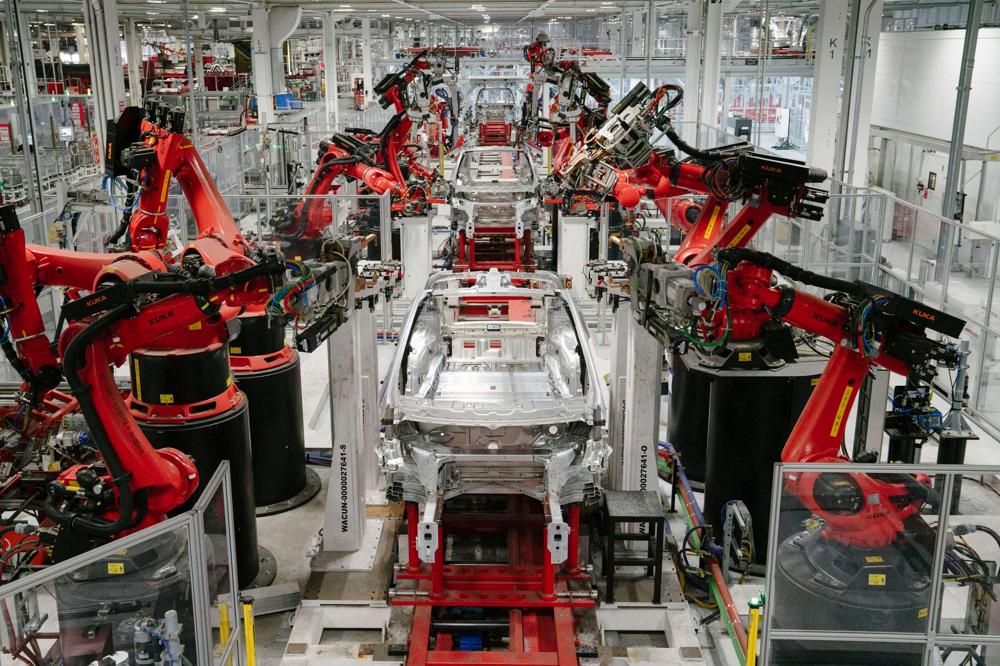
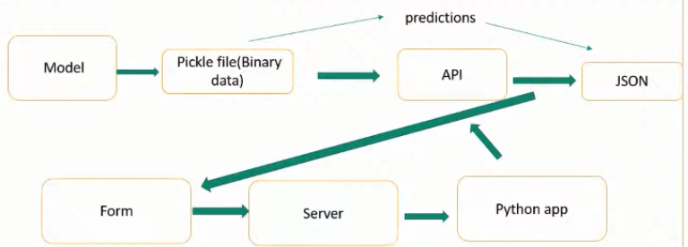

# Day 2

## INSTANCE BASED LEARNING vs MODEL BASED LEARNING

### Instance Based Learning

System learns examples by heart and generalizes the new cases by comparing it with the similarities.

  

### Model Based Learning

Building a model to predict the generalization.

  

### EX: DOES MONEY MAKES PEOPLE HAPPIER?

**GDP per capita vs Life satisfaction data set**  

  

**Can you see a Model?**

  

**Determine the best model using the parameters** 

  

* Specify a performance measure(Utility function or cost function)
* Utility(fitness) function determines how good your model is
* Cost function determines how bad the model is
* For linear regression problems normally use the cost function which measures the distance between linear model predictions and the training examples.  

**Best fit Model**

  

## CHALLENGES IN ML

1. Data Collection
2. Insufficient data
3. Non-representative data
4. Poor quality data
5. Irrelevant Features
6. Overfitting and Underfitting
7. Software Integration
8. Deployment
9. Cost

### DATA COLLECTION

If you do not have ready-made data then gathering data is a difficult task:  

Two methods can be used:  
1. API
2. Web Scraping

### INSUFFICIENT DATA

* How a Toller learns “What is an Apple?”
* For small Machine Learning problem also needs thousands of examples
* Image recognition, and speech recognition may need millions of examples
* If data is insufficient can be reused the parts of the existing model

Eg: MICROSOFT Research of Algorithms vs Data  

  

### NON REPRESENTATIVE TRAINING DATA

  

#### Sample Noise

When the sample is very small , non-representative data as a result of chance  

#### Sample Bias

If the sample is very large, non-representative data exists if the sample method is flawed.  
Ex:(Literary digests Sampling method for Roosevelt vs Landon)  

### POOR QUALITY DATA

* Data Can be in various formats
* Data can have missing values.
* Outliers may be available
* If 5% of data is having missing features, remove the feature or fill it by the average or median.
* If clearly see an outlier remove the outlier manually

### IRRELEVANT FEATURES

* Garbage in Garbage out
* Feature Engineering:
  1. Feature Selection: Select most useful features
  2. Feature Extraction: Combining existing features to combine more useful one(use dimensionality reduction)
  3. Creating new feature by gathering new data
* Scenario of the fitness of an athlete

### OVERFITTING

* Model performs well on the training data. But it does not generalize well
* Ex: Taxi driver example

  

#### HOW OVERFITTING HAPPENS

Overfitting happens when the model is too complex relative to the amount and noisiness of the training data. The possible solutions are:  

* To simplify the model by selecting one with fewer parameters  
  (Eg: a linear model rather than a high-degree polynomial model), by reducing the number of attributes in the training data or by constraining the model
* To gather more training data
* To reduce the noise in the training data  
  (Eg: fix data errors and remove outliers)

#### REGULARIZATION

Constraining a model to make it simpler and reduce the risk of overfitting is called Regularization.

  

#### HYPER PARAMETER

* The amount of regularization to apply during learning can be controlled by a Hyper Parameter.
* Hyper Parameter is a parameter of a learning algorithm (not of the model)
* It is not affected by the learning algorithm itself.
* It must be set prior to the training and remains constant during the training.
* If the regularization Hyper Parameter is set to a very large value, you will get almost flat value, implies no overfitting, but less likely to find a good solution.

### UNDERFITTING

**Underfitting the Training Data**  

As you might guess, underfitting is the opposite of overfitting: it occurs when your model is too simple to learn the underlying structure of the data. For example, a linear model of life satisfaction is prone to underfit; reality is just more complex than the model, so its predictions are bound to be inaccurate, even on the training examples.  

The main options to fix this problem are:  
* Selecting a more powerful model, with more parameters
* Feeding better features to the learning algorithm (feature engineering)
* Reducing the constraints on the model (Eg: reducing the regularization Hyper Parameter)

If the training error is low (Eg: your model makes few mistakes on the training set) but the generalization error is high, it means that your model is overfitting the training data.  

_GIVING 100% ACCURACY -> It shows your model is overfitting_

#### HYPER PARAMETER TUNING

A common solution to this problem is called holdout validation: you simply hold out part of the training set to evaluate several candidate models and select the best one. The new heldout set is called the validation set (or sometimes the development set, or dev set). More specifically, you train multiple models with various Hyper parameters on the reduced training set (i.e., the full training set minus the validation set), and you select the model that performs best on the validation set. After this holdout validation process, you train the best model on the full training set (including the validation set), and this gives you the final model. Lastly, you evaluate this final model on the test set to get an estimate of the generalization error.  

#### HOW SHOULD BE THE VALIDATION SET?

This solution usually works quite well. However, if the validation set is too small, then model evaluations will be imprecise: you may end up selecting a suboptimal model by mistake. Conversely, if the validation set is too large, then the remaining training set will be much smaller than the full training set. Why is this bad? Well, since the final model will be trained on the full training set, it is not ideal to compare candidate models trained on a much smaller training set. It would be like selecting the fastest sprinter to participate in a marathon. One way to solve this problem is to perform repeated cross-validation, using many small validation sets. Each model is evaluated once per validation set, after it is trained on the rest of the data. By averaging out all the evaluations of a model, we get a much more accurate measure of its performance. However, there is a drawback: the training time is multiplied by the number of validation sets.  

### SOFTWARE INTEGRATION

* There are different platforms integration of different platform is a challenge  
* Batch learning
* Deployment

### COST INVOLVED

* How to measure cost for application
* How to calculate cost

## APPLICATIONS IN ML

Retail: Amazon, Big Bazaar

* They take your number and create a profile.
* There are thousands of scenarios that we can see ML is integrated
* Ex:  
  Facebook: Friends recommendation  
  Amazon: Product recommendation  
  Chatbots  
* Normally these scenarios can be mainly categorized in to B2B applications and B2C applications.

## B2B APPLICATIONS

1. Retail
2. Transportation
3. Manufacturing
4. Banking
5. Social media
6. Space exploration
7. Medical

### RETAIL

1. To stock up in retailing; For this, it is needed which goods need to be stocked up and which product is not needed to be stocked up. Data mining is done and identifies the buying behavior here. So ML is needed here.
2. Have you ever wondered why retail shops take your phone number?  
   They create your own profile. According to the way you are buying the goods from the other places(using metadata)  
   Then they can have a target audience according to your profile.  
3. Correlation of goods using association rule learning.

### TRANSPORTATION

Eg: Uber Driver Mobile App

  

### MANUFACTURING

**PREDICTIVE MAINTENANCE - Eg: TESLA**  

Tesla uses high automated processes to manufacture their cars. They use robotic arms to host their Engine and the things. If there is a failure of these robotic arms, then the manufacturing process will be delayed. To avoid that, IoT devices are launched in the robotic arms and detect the faults before they fail.  

  

**CONSUMER INTERNET - Eg: Twitter**  

* Using sentiment analysis to generate profits.
* Can create a repository of Human Intelligence
* Political influence affects to the stock market

### BANK AND FINANCE

* If you apply for a loan , then the first thing happening in the finance sector is creating your own profile. Then this profile will be analyzed in two ways.    
  1. Analyzing using a ML method  
  2. Analyzing manually using a loan officer  
* When analyzing your profile with ML method your profile will be compared with past loan defaulters. If there is a 70-80% similarity between profile then it will be a red alarm to the bank.
* Which types of promotions should be done
* What has a high chance to establish a new branch

## MACHINE LEARNING DEVELOPMENT LIFE CYCLE

* Set of guidelines to follow when developing a Machine Learning based product.
* Here it is guided from the idea to the end product.
* In interviews, it is tested the end to end project development(not just the model training)

### 9 STEPS OF MACHINE LEARNING DEVELOPMENT LIFE CYCLE

1. Frame the problem
2. Gathering data
3. Data pre-processing
4. Exploratory data analysis
5. Feature engineering and selection
6. Model training , Evaluation and selection
7. Model deployment
8. Testing
9. Optimize

#### FRAME THE PROBLEM: GETTING THE MENTAL IMAGE

* What exactly is the problem?
* How to solve it?
* Who are the customers?
* How much will it cost?
* Amount of the team?
* The appearance of the product?
* Supervised or unsupervised?
* Online or batch mode?
* Which types of algorithms?
* How to get the data?

#### DATA GATHERING

* API method: Use a python code to hit the API and fetch the data using the Json format, and can be converted in to any format(CSV)
* Web scraping
* Database → ETL → Dataware Housing → Fetching data
* Big data → Spark clusters → fetching

#### DATA PRE-PROCESSING-DATA CANNOT BE USED DIRECTLY, HAS TO BE CLEANED.

* Missing data
* structural issues
* Outliers
* Noice
* What can be done in pre-processing:
* Remove duplications
* Remove missing values
* Remove outliers
* Feature scaling

#### EXPLORATORY DATA ANALYSIS: GETTING CONCRETE IDEA ABOUT DATA

* Studying the relationships between input and the output
* Doing visualizations
* Uni variate analysis: analyzing each column (mean, standard deviation, curve)
* Bi variate and multi variate analysis
* Outlier detection
* Imbalance detection(Ex: In Cat /dog classification , one has more images)

#### FEATURE ENGINEERING AND SELECTION

* Features are the input columns.
* Feature Engineering: Intelligently change the features of some columns and generating new columns.
* Feature selection: Only the important features are selected.

#### MODEL TRAINING , EVALUATION AND SELECTION

* There are different types of algorithms, it is needed to identify what is the best suited algorithm:
* Linear matrix:
* Kernel matrix:
* Ensample learning:
* Neural networks:
* Clustering:
* Evaluation: Using different matrix according to the algorithm, rate the performance. Ex: classification- Accuracy matrix, Regression-Mean squared error, Clustering-Dumb index
* Selecting the best-performed algo and tune the parameters of it and use Ensample learning.

#### MODEL DEPLOYMENT

  

#### TESTING

* Beta testing

#### OPTIMIZING

* Model backup
* Data backup
* Load balancing
* Retraining

## JOB ROLES in (AI / ML / DL)

* MLDLC has several phases, In a large company, each job role is assigned for a specific phase.

### DATA ENGINEER

**Responsibilities**

* Scrape data from the given sources
* Move or store data in optimal servers / data warehouses.
* Build data pipelines. / APIs for easy access to the data.
* Handle databases / Data warehouses.

**Skills**

* Strong grasp of algorithms and data structures.
* Programming languages(Java/Python/R/Scala)
* Advanced DBMS
* Big data tools(Apache Spark, Hadoop, Apache Kafka, Apache Hive)
* Cloud platforms(AWS, google cloud)
* Distributed systems
* Data pipelines.

### DATA ANALYST / BUSINESS ANALYST

**Responsibilities**

* Cleaning and organizing raw data
* Analyzing data to derive insights
* Creating data visualizations
* Producing and maintaining reports
* Collaborating with teams
* Optimizing data collection procedures.

**Skills**

* Statistical programming
* Programming languages(R/SAS/python)
* Creative and Analytical thinking
* Business Acumen – Medium to high
* Strong communication skills
* Data mining / Cleaning and munging
* Data visualization
* Data storytelling
* SQL
* Advanced Microsoft Excel

### DATA SCIENTIST

* “Data Scientist is someone who is better at statistics than any software engineer and better at software engineering than any Statistician”
* Data analyst summarizes the data, data Scientist predict the future(Predictive modelling)
* Main duty o a data Scientist in a larger company: Best model creation
* Small company: Start to end everything

### ML ENGINEER

**Responsibilities**

* Deploying machine learning models to a production-ready environment.
* Scaling and optimizing the model for production
* Monitoring and maintenance of deployed models.

**Skills**

* Mathematics
* Programming languages(R/Java/Python/Scala)
* Distributed systems
* Data model and evaluation
* Machine learning algorithms
* Software Engineering and system design

### COMPARISON

|                | Analytical skills | Business acumen | Data Story telling | Soft Skills    | Software Skills |
|----------------|-------------------|-----------------|--------------------|----------------|-----------------|
| Data Analyst   | High              | Medium to High  | High               | Medium to High | Medium          |
| Data Engineer  | Medium            | Low             | Low                | Medium         | High            |
| Data Scientist | High              | High            | High               | High           | Medium          |
| ML Engineer    | Medium to High    | Medium          | Low                | High           | High            |  

