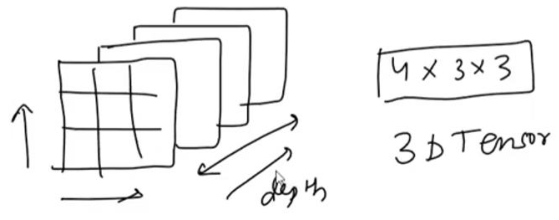
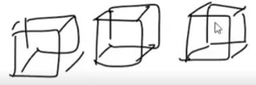
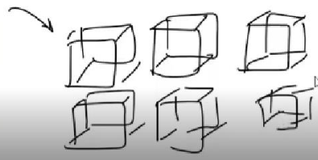
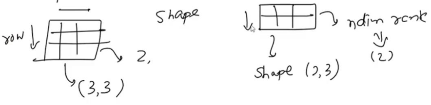

# Day 4

## TENSORS

* Tensor is a data structure.
* Tensor is the basic data structure in Scikit learn and Tensorflow libraries.
* Tensor is a container for numbers.

## 0-D TENSORS / SCALERS

* If single number is stored like 2, 3 those are called 0-D tensor or Scaler.
* 0-D → No dimension

## 1-D TENSOR-VECTOR

### VECTOR

* This is a 1D array or 1D tensor.
* But in this vector , it has 4 elements. Therefore, the dimension of the vector is 4 here.
* No of axis = rank = dimension
* Vector → 1 axis
* Eg: [1,2]  
  Tensor → 1D (Tensor Dimension is 1)  
  Vector → 2D (Vector Dimension is 2)  

# 2-D TENSORS / MATRICES

* Collection of multiple vectors is a matrix

* [1,2,3],[4,5,6],[7,8,9]

* [[1,2,3]  
  [4,5,6]  
  [7,8,9]] → two axis - (row vector, column vector)

* Rank = ndim = 2

## N-D TENSOR

### 3-D TENSOR

### 4-D TENSOR

* Vector of 3 D tensor
* 3-D tensor is a cuboid
* Collection of 3-D tensors is a 4-D tensor

### 5-D TENSOR

* Matrix of 4-D tensor

### 6-D TENSOR

* Collection of 5-D tensors

## RANK, AXES AND SHAPE

* Number of axes = Rank = Number of dimensions
* Shape: how many items can be stored in an axis

