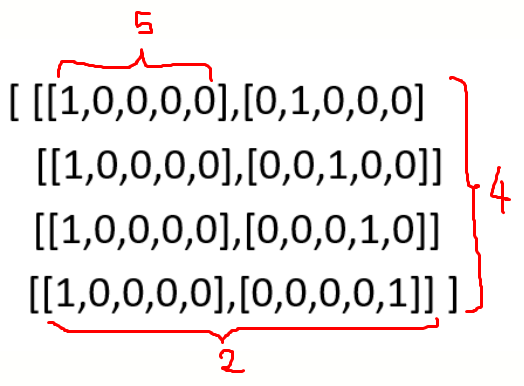

# Day 4

## TENSORS

* Tensor is a data structure.
* Tensor is the basic data structure in Scikit learn and Tensorflow libraries.
* Tensor is a container for numbers.

## 0-D TENSORS / SCALERS

* If single number is stored like 2, 3 those are called 0-D tensor or Scaler.
* 0-D → No dimension

## 1-D TENSOR-VECTOR

### VECTOR

* This is a 1D array or 1D tensor.
* But in this vector , it has 4 elements. Therefore, the dimension of the vector is 4 here.
* No of axis = rank = dimension
* Vector → 1 axis
* Eg: [1,2]  
  Tensor → 1D (Tensor Dimension is 1)  
  Vector → 2D (Vector Dimension is 2)  

# 2-D TENSORS / MATRICES

* Collection of multiple vectors is a matrix

* [1,2,3],[4,5,6],[7,8,9]

* [[1,2,3]  
  [4,5,6]  
  [7,8,9]] → two axis - (row vector, column vector)

* Rank = ndim = 2

## N-D TENSOR

### 3-D TENSOR

### 4-D TENSOR

* Vector of 3 D tensor
* 3-D tensor is a cuboid
* Collection of 3-D tensors is a 4-D tensor

### 5-D TENSOR

* Matrix of 4-D tensor

### 6-D TENSOR

* Collection of 5-D tensors

## RANK, AXES AND SHAPE

* Number of axes = Rank = Number of dimensions
* Shape: how many items can be stored in an axis
* Eg: shape(rows/columns) -> shape(2,3)

## SIZE OF A TENSOR

* Multiplication of the shape
* Size of scaler = 1
* Size of vector = number of elements in the vector

## EXAMPLE - 1-D TENSOR

* 1-D tensor
* [3.7, 94, 0]

| CGPA | IQ  | District | Placement |
|------|-----|----------|-----------|
| 3.7  | 94  | Colombo  | 1         |

* Every machine Learning table, each row is a 1-D tensor, but it will be a multidimensional vector.
* Also in a machine learning problem, each column can be considered as a 1-D tensor.

## EXAMPLE - 2-D TENSOR

* Rows combination
* [3.9, 123, 0]
* [3.7, 99, 1]
* [3.6, 88, 1]

| CGPA | IQ  | District |
|------|-----|----------|
| 3.9  | 123 | Colombo  |
| 3.7  | 99  | Galle    |
| 3.6  | 88  | Kandy    |

* Collection of 1-D tensors is a 2-D tensor, So collection of rows in a ML data set , is a 2-D tensor (Matrix)

## EXAMPLE 1 - 3-D TENSOR

* 3-D tensors are not as frequent as 2-D or 1-D tensors in ML. But this is commonly used in NLP. In ML problems when we want to deal with texts it should be converted in to numbers.
* Hi Onara
* Hi Danuja
* Hi Deen
* Hi Dewmini

| Hi  | Onara | Danuja | Deen | Dewmini |
|-----|-------|--------|------|---------|
| 1   | 0     | 0      | 0    | 0       |
| 0   | 1     | 0      | 0    | 0       |
| 0   | 0     | 1      | 0    | 0       |
| 0   | 0     | 0      | 1    | 0       |
| 0   | 0     | 0      | 0    | 1       |

* Hi Onara: [[1,0,0,0,0],[0,1,0,0,0]]
* Hi Danuja: [[1,0,0,0,0],[0,0,1,0,0]]
* Hi Deen: [[1,0,0,0,0],[0,0,0,1,0]]
* Hi Dewmini: [[1,0,0,0,0],[0,0,0,0,1]]

### HOW TO GET THE SHAPE OF THE 3-D TENSOR?

* (how many matrices, how many vectors, How many elements)
* (4,2,5)=40

## EXAMPLE 2 - 3-D TENSOR

* Time series data: Time series data is the data that is taken at frequent time intervals.
* Ex: data of the share market (daily basis)→ 365 days
* If this is taken for some number of years, then it is a 3-D tensor

## EXAMPLE - 4-D TENSOR: IMAGED BASED DATA

* We can find 4-D tensors in the computer vision domain.
* Every image is a collection of pixels. Each pixel has a numerical value.
* If it is a color image, it has three channels called RGB values. So it is a 3-D tensor.
* What if it is a multiple images. Then it is a 4-D tensor.
* (3,1200,800) → 3-D tensor
* (50,3,1200,800) → 4-D tensor

## EXAMPLE - 5-D TENSORS: VIDEOS

* Videos are basically frames which are moving fast.(Collection of frames)
* Suppose a video of 60 s and 30 fps with a resolution of 480p , that means 480x720, 3 channels (RGB)-Color Image.
* 1 image = 480 x 720 x 3
* Since 30 fps => 30 x 480 x 720 x 3
* Since 60 sec → 60 x 30 x 480 x 720 x 3=(1800,480,720,3) → 4-D tensor
* If there are 4 videos then it is a 5-D tensor → (4,1800,480,720,3)
* This size is a very large one.
* If this is stored in 32-bit float → then that number x 32
* To convert byte/8, to convert killo byte/1024, megabyte/1024, gigabyte/1024 → 27
* So to store this type of video it is needed to have , 27. GB
* But it is used vide encoded formats like Mkv,MPEG,Mp4 and reduced the amount.

# FRAMING A DATA SCIENCE PROBLEM

1. Magic 7’s
2. Business concept and the data and the Technical concept

## BUSINESS CONCEPT VS TECHNICAL CONCEPT

| Business Concept                                     | Data         | Technical Concept                |
|------------------------------------------------------|--------------|----------------------------------|
| Human can analyze, Identify pattern & Make Decision. | Numerical    | Machine Learning & Deep Learning |
| Human can listen & Speak                             | Text/Audio   | ML/DL/NLP                        |
| Human Can see & Recognize                            | Image/ Video | Computer vision & Deep Learning  |
| Brain signal processing                              | EEG          | ML/DL                            |

### HOW A COMPANY GENERATE PROFITS?

1. Searching revenue from new customers
2. Getting more revenue from existing customers.
3. Reducing the churn rate (stop subscribing to a service)

## Magic 7’s

### 1.CONVERT BUSINESS PROBLEM TO ML PROBLEM

* Convert the Business Problem to a mathematical problem.
* Ex: Reduce the Churn rate from 5% to 4.75%

### 2. TYPE OF PROBLEM

* Identify the big picture (Identify the end product)
* Main goal: Churn rate reduction?
* How to reduce churn rate?
* Your goal is not to predict the chain rate, your goal is to reduce it.
* Identify the customers who are going to leave the platform?
* Identify the problems of leaving the platform?
* If a customer leaving the platform, offer him a discount?
* Supervised learning → Classification → Stealing or Not
* Offer the discount and see what is the probability that he is leaving the platform → It is now a regression problem.

### 3. CURRENT SOLUTION

* Overall churn rate% measured by an existing model;
* Factors considered for the existing model.

### 4. GETTING DATA

1. Watch time:
2. Search but did not find
3. Content left in the middle
4. Clicked on recommendations

### 5. METRICS TO MEASURE

* Model successful or not?
* How accuracy of the model?

### 6. ONLINE OR BATCH

### 7. CHECK ASSUMPTIONS

* Will your attributes available?
* Single model or multi model ?
* Geography based models?

## DATA GATHERING

1. CSV: 90% of Kaggle’s data is in CSV format. Easy to get.
2. JSON/SQL: SQL Data taken from databases
3. Fetch data from API: Pull data from a server of an actual website.
4. Web Scraping: If the website does not provide data, no API, then we can use web scraping to get the data.
